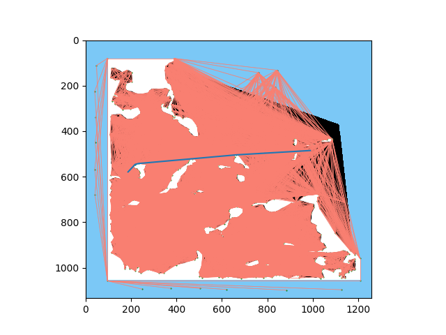
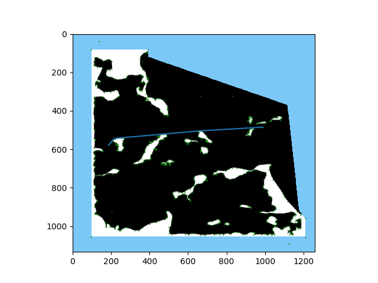
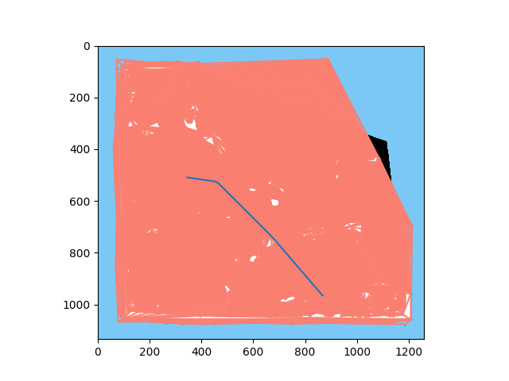
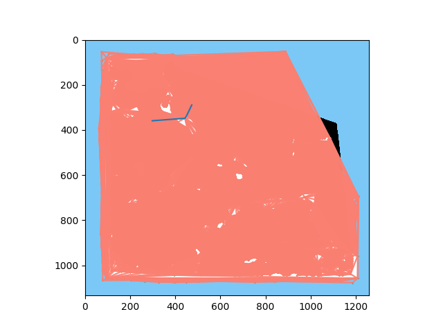
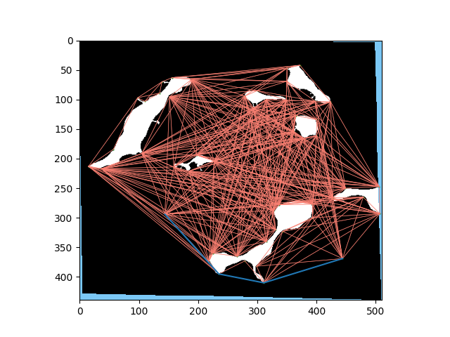
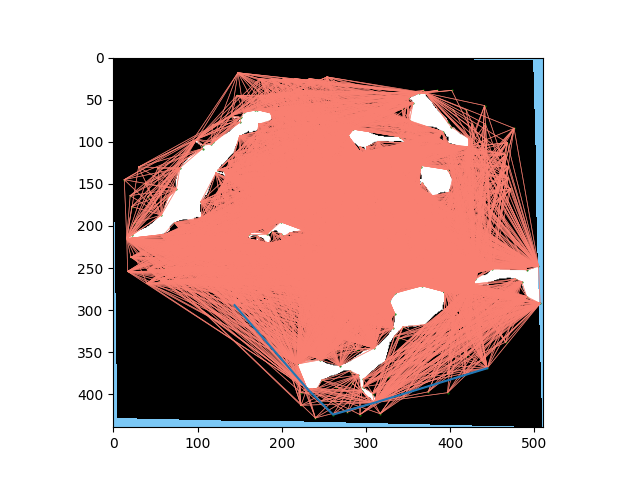
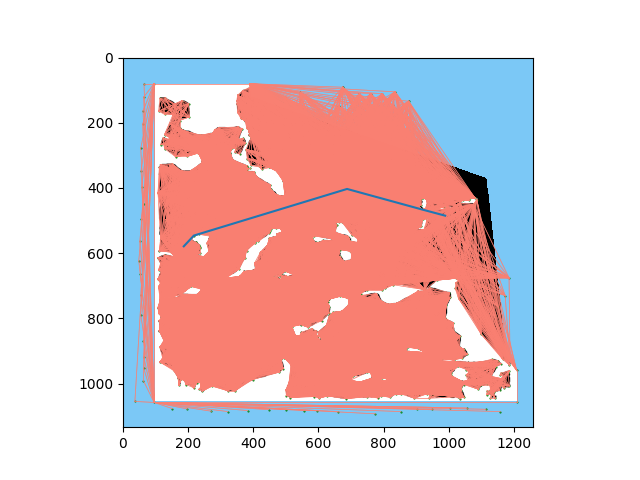

## GSEN 6331 class project
## Spring 2020
## Experimental results

### Path planning in dynamic marine environments

- Marine environment has dynamic water currents (varies over space and time)
- Path planning minimizes energy consumption
- Compare Astar, Dijkstra using uniform grids, visibility graphs, and extended visibility graphs
- Extended visibility graphs add additional nodes/edges to a visibility graph for additional choices for energy efficiency

### Study region


### Data descriptions

- **Currents:** dynamic water currents over entire study region
	- Velocity magnitude (m/s): `waterMag.tif`
	- Velocity direction (m/s): `waterDir.tif`
	- Dimensions (pixels): 1000 x 1093
	- Bands:
		- Each represents a single time interval
		- 1 hour between intervals
		- 4 bands
	- Source: The Northeast Coastal Ocean Forecast System (http://fvcom.smast.umassd.edu/necofs/)

- **Full:** entire region 
	- Binary occupancy grid: `full.tif`
	- (1 = occupied/land, 0 = free/water)
	- Dimensions (pixels): 1000 x 1093
	- Resolution: xxxxx
	- Source: NOAA World Vector Shorelines (https://shoreline.noaa.gov/data/datasheets/wvs.html)

- **Mini:** subregion of Full
	- Binary occupancy grid: `mini.tif`
	- (1 = occupied/land, 0 = free/water)
	- Dimensions (pixels): 439 x 511
	- Resolution: xxxx
	- Source: NOAA World Vector Shorelines (https://shoreline.noaa.gov/data/datasheets/wvs.html)

### Graph generation

The uniform graph, visibility graph, and extended visibility graph are made only once for each region

#### Uniform graphs

- Full
	- Mean creation time (5 trials): 10.538 seconds
	- Number of nodes: 751111
	- Number of edges: 
	- Files:
		- Graph: `full_uni.pickle` 
		- Plot: `full_uni.png`

```python3 planners/gplanner_build.py -r test/gsen6331/full.tif -g test/gsen6331/full_uni.pickle -m test/gsen6331/full_uni.png
```


- Mini
	- Mean creation time (5 trials): 2.688 seconds
	- Number of nodes: 201203
	- Number of edges: 
	- Files:
		- Graph: `mini_uni.pickle`
		- Plot: `mini_uni.png`

```python3 planners/gplanner_build.py -r test/gsen6331/mini.tif -g test/gsen6331/mini_uni.pickle -m test/gsen6331/mini_uni.png
```


#### Visibility graphs

- Full
	- Mean creation time (1 thread, 5 trials): 20.009 seconds
	- Mean creation time (4 threads, 5 trials): 10.235 seconds
	- Number of nodes: 
	- Number of edges: 1037
	- Files:
		- Graph: `full_vg.graph` 
		- Plot: `full_vg.png`

```python3 planners/vgplanner_build.py -r test/gsen6331/full.tif -g test/gsen6331/full_vg.graph -s test/gsen6331/full.shp -m test/gsen6331/full_poly.png -v test/gsen6331/full_vg.png -n 4 --build
```


- Mini
	- Mean creation time (1 thread, 5 trials): 1.371 seconds
	- Mean creation time (4 threads, 5 trials): 0.780 seconds
	- Number of nodes: 
	- Number of edges: 140
	- Files:
		- Graph: `mini_vg.graph` 
		- Plot: `mini_vg.png`

```python3 planners/vgplanner_build.py -r test/gsen6331/mini.tif -g test/gsen6331/mini_vg.graph -s test/gsen6331/mini.shp -m test/gsen6331/mini_poly.png -v test/gsen6331/mini_vg.png -n 4 --build
```


#### Extended visibility graphs

- Full (A, less added nodes)
	- Params: (ydiff: 10, xdiff: 10, radius:10, threshold: 2)
	- Base visibility graph: `full_vg.graph`
	- Mean _additional_ creation time:
	- Number of nodes:
	- Number of edges:
	- File:
		- Graph: full_evg-a.graph
		- Plot: full_evg-a.png

```python3 planners/vg2evg.py -r test/gsen6331/full.tif -v test/gsen6331/full_vg.graph -e test/gsen6331/full_evg-a.graph -m test/gsen6331/full_evg-a.png --xdiff 10 --ydiff 10 --radius 10 --threshold 2
```


- Full (B, more added nodes)
	- Params: (ydiff: 2.5, xdiff: 2.5, radius:30, threshold: 2)
	- Base visibility graph: `full_vg.graph`
	- Mean _additional_ creation time:
	- Number of nodes:
	- Number of edges:
	- File:
		- Graph: full_evg-b.graph
		- Plot: full_evg-b.png

```python3 planners/vg2evg.py -r test/gsen6331/full.tif -v test/gsen6331/full_vg.graph -e test/gsen6331/full_evg-b.graph -m test/gsen6332/full_evg-b.png --xdiff 5 --ydiff 5 --radius 15 --threshold 2
```


- Mini (A, less added nodes)
	- Params: (ydiff: 10, xdiff: 10, radius: 15, threshold: 2)
	- Base visibility graph: `mini_vg.graph`
	- Mean _additional_ creation time:
	- Number of nodes:
	- Number of edges:
	- File:
		- Graph: mini_evg-a.graph
		- Plot: mini_evg-a.png

```python3 planners/vg2evg.py -r test/gsen6331/mini.tif -v test/gsen6331/mini_vg.graph -e test/gsen6331/mini_evg-a.graph -m test/gsen6331/mini_evg-a.png
```


- Mini (B, more added nodes)
	- Params: (ydiff: 7, xdiff: 7, radius:20, threshold: 2)
	- Base visibility graph: `mini_vg.graph`
	- Mean _additional_ creation time:
	- Number of nodes:
	- Number of edges:
	- File:
		- Graph: mini_evg-b.graph
		- Plot: mini_evg-b.png

```python3 planners/vg2evg.py -r test/gsen6331/mini.tif -v test/gsen6331/mini_vg.graph -e test/gsen6331/mini_evg-b.graph -m test/gsen6331/mini_evg-b.png
```


### Path planning missions

- Mission: FP1
	- Region: Full
	- Start: (42.32343 N, -70.99428 E)
	- Goal:  (42.33600 N, -70.88737 E)
	- Boat speed: 0.5 meters/second

- Mission: FP2
	- Region: Full
	- Start: (42.33238 N, -70.97322 E)
	- Goal:  (42.27183 N, -70.90341 E)
	- Boat speed: 0.5 meters/second

- Mission: FP3
	- Region: Full
	- Start: (42.36221 N, -70.95617 E)
	- Goal:  (42.35282 N, -70.97952 E)
	- Boat speed: 0.5 meters/second

- Mission: MP1
	- Region: Mini
	- Start: (42.29000 N, -70.92000 E)
	- Goal:  (42.30000 N, -70.96000 E)
	- Boat speed: 0.5 meters/second

### Path planning experiments

- Experiment: FP1-AA
	- Setup:
		- Mission: FP1
		- Solver: Dijkstra
		- Graph: uniform
		- Currents? disabled
	- Results:
		- Planning time:
		- Distance:
		- Duration:
		- Cost (currents): N/A

```python3 planners/gplanner_solve.py -r test/gsen6331/full.tif -g test/gsen6331/full_uni.pickle -u None --sy 42.32343  --sx -70.99428  --dy 42.33600  --dx -70.88737  --solver dijkstra --speed 0.5 -m test/gsen6331/FP1-AA.png
```


- Experiment: FP1-AB
	- Setup:
		- Mission: FP1
		- Solver: Astar
		- Graph: uniform
		- Currents? disabled
	- Results:
		- Planning time:
		- Distance:
		- Duration:
		- Cost (currents): N/A

```python3 planners/gplanner_solve.py -r test/gsen6331/full.tif -g test/gsen6331/full_uni.pickle -u None --sy 42.32343  --sx -70.99428  --dy 42.33600  --dx -70.88737  --solver a* --speed 0.5 -m test/gsen6331/FP1-AB.png
```


- Experiment: FP1-AC
	- Setup:
		- Mission: FP1
		- Solver: Dijkstra (current-aware)
		- Graph: uniform
		- Currents? enabled
	- Results:
		- Planning time:
		- Distance:
		- Duration:
		- Cost (currents):

```python3 planners/gplanner_solve.py -r test/gsen6331/full.tif -g test/gsen6331/full_uni.pickle -u None --sy 42.32343  --sx -70.99428  --dy 42.33600  --dx -70.88737  --solver dijkstra --speed 0.5 -m test/gsen6331/FP1-AC.png --currents_mag test/gsen6331/waterMag.tif --currents_dir test/gsen6331/waterDir.tif
```


- Experiment: FP1-AD
	- Setup:
		- Mission: FP1
		- Solver: Astar (current-aware)
		- Graph: uniform
		- Currents? enabled
	- Results:
		- Planning time:
		- Distance:
		- Duration:
		- Cost (currents):

```python3 planners/gplanner_solve.py -r test/gsen6331/full.tif -g test/gsen6331/full_uni.pickle -u None --sy 42.32343  --sx -70.99428  --dy 42.33600  --dx -70.88737  --solver a* --speed 0.5 -m test/gsen6331/FP1-AD.png --currents_mag test/gsen6331/waterMag.tif --currents_dir test/gsen6331/waterDir.tif
```


- Experiment: FP2-AA
	- Setup:
		- Mission: FP2
		- Solver: Dijkstra
		- Graph: uniform
		- Currents? disabled
	- Results:
		- Planning time:
		- Distance:
		- Duration:
		- Cost (currents): N/A

```python3 planners/gplanner_solve.py -r test/gsen6331/full.tif -g test/gsen6331/full_uni.pickle -u None --sy 42.33283  --sx -70.97322  --dy 42.27183  --dx -70.90341  --solver dijkstra --speed 0.5 -m test/gsen6331/FP2-AA.png
```


- Experiment: FP2-AB
	- Setup:
		- Mission: FP2
		- Solver: Astar
		- Graph: uniform
		- Currents? disabled
	- Results:
		- Planning time:
		- Distance:
		- Duration:
		- Cost (currents): N/A

```python3 planners/gplanner_solve.py -r test/gsen6331/full.tif -g test/gsen6331/full_uni.pickle -u None --sy 42.33283  --sx -70.97322  --dy 42.27183  --dx -70.90341 --solver a* --speed 0.5 -m test/gsen6331/FP2-AB.png
```


- Experiment: FP2-AC
	- Setup:
		- Mission: FP2
		- Solver: Dijkstra (current-aware)
		- Graph: uniform
		- Currents? enabled
	- Results:
		- Planning time:
		- Distance:
		- Duration:
		- Cost (currents):

```python3 planners/gplanner_solve.py -r test/gsen6331/full.tif -g test/gsen6331/full_uni.pickle -u None --sy 42.33283  --sx -70.97322  --dy 42.27183  --dx -70.90341 --solver dijkstra --speed 0.5 -m test/gsen6331/FP2-AC.png --currents_mag test/gsen6331/waterMag.tif --currents_dir test/gsen6331/waterDir.tif
```


- Experiment: FP2-AD
	- Setup:
		- Mission: FP2
		- Solver: Astar (current-aware)
		- Graph: uniform
		- Currents? enabled
	- Results:
		- Planning time:
		- Distance:
		- Duration:
		- Cost (currents):

```python3 planners/gplanner_solve.py -r test/gsen6331/full.tif -g test/gsen6331/full_uni.pickle -u None --sy 42.33283  --sx -70.97322  --dy 42.27183  --dx -70.90341  --solver a* --speed 0.5 -m test/gsen6331/FP2-AD.png --currents_mag test/gsen6331/waterMag.tif --currents_dir test/gsen6331/waterDir.tif
```


- Experiment: FP3-AA
	- Setup:
		- Mission: FP3
		- Solver: Dijkstra
		- Graph: uniform
		- Currents? disabled
	- Results:
		- Planning time:
		- Distance:
		- Duration:
		- Cost (currents): N/A

```python3 planners/gplanner_solve.py -r test/gsen6331/full.tif -g test/gsen6331/full_uni.pickle -u None --sy 42.36221 --sx -70.95617 --dy 42.35282 --dx -70.97952 --solver dijkstra --speed 0.5 -m test/gsen6331/FP3-AA.png
```


- Experiment: FP3-AB
	- Setup:
		- Mission: FP3
		- Solver: Astar
		- Graph: uniform
		- Currents? disabled
	- Results:
		- Planning time:
		- Distance:
		- Duration:
		- Cost (currents): N/A

```python3 planners/gplanner_solve.py -r test/gsen6331/full.tif -g test/gsen6331/full_uni.pickle -u None --sy 42.36221 --sx -70.95617 --dy 42.35282 --dx -70.97952  --solver a* --speed 0.5 -m test/gsen6331/FP3-AB.png
```


- Experiment: FP3-AC
	- Setup:
		- Mission: FP3
		- Solver: Dijkstra (current-aware)
		- Graph: uniform
		- Currents? enabled
	- Results:
		- Planning time:
		- Distance:
		- Duration:
		- Cost (currents):

```python3 planners/gplanner_solve.py -r test/gsen6331/full.tif -g test/gsen6331/full_uni.pickle -u None --sy 42.36221 --sx -70.95617 --dy 42.35282 --dx -70.97952 --solver dijkstra --speed 0.5 -m test/gsen6331/FP3-AC.png --currents_mag test/gsen6331/waterMag.tif --currents_dir test/gsen6331/waterDir.tif
```


- Experiment: FP3-AD
	- Setup:
		- Mission: FP3
		- Solver: Astar (current-aware)
		- Graph: uniform
		- Currents? enabled
	- Results:
		- Planning time:
		- Distance:
		- Duration:
		- Cost (currents):

```python3 planners/gplanner_solve.py -r test/gsen6331/full.tif -g test/gsen6331/full_uni.pickle -u None --sy 42.36221 --sx -70.95617 --dy 42.35282 --dx -70.97952 --solver a* --speed 0.5 -m test/gsen6331/FP3-AD.png --currents_mag test/gsen6331/waterMag.tif --currents_dir test/gsen6331/waterDir.tif
```


- Experiment: MP1-AA
	- Setup:
		- Mission: MP1
		- Solver: Dijkstra
		- Graph: uniform
		- Currents? disabled
	- Results:
		- Planning time:
		- Distance:
		- Duration:
		- Cost (currents): N/A

```python3 planners/gplanner_solve.py -r test/gsen6331/mini.tif -g test/gsen6331/mini_uni.pickle -u None --sy 42.29 --sx -70.92  --dy 42.30  --dx -70.96  --solver dijkstra --speed 0.5 -m test/gsen6331/MP1-AA.png
```


- Experiment: MP1-AB
	- Setup:
		- Mission: MP1
		- Solver: Astar
		- Graph: uniform
		- Currents? disabled
	- Results:
		- Planning time:
		- Distance:
		- Duration:
		- Cost (currents): N/A

```python3 planners/gplanner_solve.py -r test/gsen6331/mini.tif -g test/gsen6331/mini_uni.pickle -u None --sy 42.29 --sx -70.92  --dy 42.30  --dx -70.96 --solver a* --speed 0.5 -m test/gsen6331/MP1-AB.png
```


- Experiment: MP1-AC
	- Setup:
		- Mission: MP1
		- Solver: Dijkstra (current-aware)
		- Graph: uniform
		- Currents? enabled
	- Results:
		- Planning time:
		- Distance:
		- Duration:
		- Cost (currents):

```python3 planners/gplanner_solve.py -r test/gsen6331/mini.tif -g test/gsen6331/mini_uni.pickle -u None --sy 42.29 --sx -70.92  --dy 42.30  --dx -70.96 --solver dijkstra --speed 0.5 -m test/gsen6331/MP1-AC.png --currents_mag test/gsen6331/waterMag.tif --currents_dir test/gsen6331/waterDir.tif
```


- Experiment: MP1-AD
	- Setup:
		- Mission: MP1
		- Solver: Astar (current-aware)
		- Graph: uniform
		- Currents? enabled
	- Results:
		- Planning time:
		- Distance:
		- Duration:
		- Cost (currents):

```python3 planners/gplanner_solve.py -r test/gsen6331/mini.tif -g test/gsen6331/mini_uni.pickle -u None --sy 42.29 --sx -70.92  --dy 42.30  --dx -70.96  --solver a* --speed 0.5 -m test/gsen6331/MP1-AD.png --currents_mag test/gsen6331/waterMag.tif --currents_dir test/gsen6331/waterDir.tif
```


		
- Experiment: FP1-BA
	- Setup:
		- Mission: FP1
		- Solver: Dijkstra
		- Graph: uniform
		- Currents? disabled
	- Results:
		- Planning time:
		- Distance:
		- Duration:
		- Cost (currents): N/A

```
		# Convert visibility graph format to standard format
		python3 planners/vg2g.py -r test/gsen6331/full.tif -v test/gsen6331/full_vg.graph -o test/gsen6331/full_vg_fp1.pickle --sy 42.32343  --sx -70.99428  --dy 42.33600  --dx -70.88737
		# Solve
		python3 planners/gplanner_solve.py -r test/gsen6331/full.tif -g test/gsen6331/full_vg_fp1.pickle -u None --sy 42.32343  --sx -70.99428  --dy 42.33600  --dx -70.88737  --solver dijkstra --speed 0.5 -m test/gsen6331/FP1-BA.png
```


- Experiment: FP1-BB
	- Setup:
		- Mission: FP1
		- Solver: Astar
		- Graph: uniform
		- Currents? disabled
	- Results:
		- Planning time:
		- Distance:
		- Duration:
		- Cost (currents): N/A

```
		# Convert visibility graph format to standard format
		python3 planners/vg2g.py -r test/gsen6331/full.tif -v test/gsen6331/full_vg.graph -o test/gsen6331/full_vg_fp1.pickle --sy 42.32343  --sx -70.99428  --dy 42.33600  --dx -70.88737
		# Solve
		python3 planners/gplanner_solve.py -r test/gsen6331/full.tif -g test/gsen6331/full_vg_fp1.pickle -u None --sy 42.32343  --sx -70.99428  --dy 42.33600  --dx -70.88737  --solver a* --speed 0.5 -m test/gsen6331/FP1-BB.png
```


- Experiment: FP1-BC
	- Setup:
		- Mission: FP1
		- Solver: Dijkstra (current-aware)
		- Graph: uniform
		- Currents? enabled
	- Results:
		- Planning time:
		- Distance:
		- Duration:
		- Cost (currents):

```
		# Convert visibility graph format to standard format
		python3 planners/vg2g.py -r test/gsen6331/full.tif -v test/gsen6331/full_vg.graph -o test/gsen6331/full_vg_fp1.pickle --sy 42.32343  --sx -70.99428  --dy 42.33600  --dx -70.88737
		# Solve
		python3 planners/gplanner_solve.py -r test/gsen6331/full.tif -g test/gsen6331/full_vg_fp1.pickle -u None --sy 42.32343  --sx -70.99428  --dy 42.33600  --dx -70.88737  --solver dijkstra --speed 0.5 -m test/gsen6331/FP1-BC.png --currents_mag test/gsen6331/waterMag.tif --currents_dir test/gsen6331/waterDir.tif
```


- Experiment: FP1-BD
	- Setup:
		- Mission: FP1
		- Solver: Astar (current-aware)
		- Graph: uniform
		- Currents? enabled
	- Results:
		- Planning time:
		- Distance:
		- Duration:
		- Cost (currents):

```
		# Convert visibility graph format to standard format
		python3 planners/vg2g.py -r test/gsen6331/full.tif -v test/gsen6331/full_vg.graph -o test/gsen6331/full_vg_fp1.pickle --sy 42.32343  --sx -70.99428  --dy 42.33600  --dx -70.88737
		# Solve
		python3 planners/gplanner_solve.py -r test/gsen6331/full.tif -g test/gsen6331/full_vg_fp1.pickle -u None --sy 42.32343  --sx -70.99428  --dy 42.33600  --dx -70.88737  --solver a* --speed 0.5 -m test/gsen6331/FP1-BD.png --currents_mag test/gsen6331/waterMag.tif --currents_dir test/gsen6331/waterDir.tif
```


- Experiment: FP2-BA
	- Setup:
		- Mission: FP2
		- Solver: Dijkstra
		- Graph: uniform
		- Currents? disabled
	- Results:
		- Planning time:
		- Distance:
		- Duration:
		- Cost (currents): N/A

```
		# Convert visibility graph format to standard format
		python3 planners/vg2g.py -r test/gsen6331/full.tif -v test/gsen6331/full_vg.graph -o test/gsen6331/full_vg_fp2.pickle --sy 42.33283 --sx -70.97322  --dy 42.27183  --dx -70.903406
		# Solve
		python3 planners/gplanner_solve.py -r test/gsen6331/full.tif -g test/gsen6331/full_vg_fp2.pickle -u None --sy 42.33283  --sx -70.97322  --dy 42.27183  --dx -70.903406  --solver dijkstra --speed 0.5 -m test/gsen6331/FP2-BA.png
```


- Experiment: FP2-BB
	- Setup:
		- Mission: FP2
		- Solver: Astar
		- Graph: uniform
		- Currents? disabled
	- Results:
		- Planning time:
		- Distance:
		- Duration:
		- Cost (currents): N/A

```
		# Convert visibility graph format to standard format
		python3 planners/vg2g.py -r test/gsen6331/full.tif -v test/gsen6331/full_vg.graph -o test/gsen6331/full_vg_fp2.pickle --sy 42.33283 --sx -70.97322  --dy 42.27183  --dx -70.903406
		# Solve
		python3 planners/gplanner_solve.py -r test/gsen6331/full.tif -g test/gsen6331/full_vg_fp2.pickle -u None --sy 42.33283  --sx -70.97322  --dy 42.27183  --dx -70.903406  --solver a* --speed 0.5 -m test/gsen6331/FP2-BB.png
```


- Experiment: FP2-BC
	- Setup:
		- Mission: FP2
		- Solver: Dijkstra (current-aware)
		- Graph: uniform
		- Currents? enabled
	- Results:
		- Planning time:
		- Distance:
		- Duration:
		- Cost (currents):

```
		# Convert visibility graph format to standard format
		python3 planners/vg2g.py -r test/gsen6331/full.tif -v test/gsen6331/full_vg.graph -o test/gsen6331/full_vg_fp2.pickle --sy 42.33283 --sx -70.97322  --dy 42.27183  --dx -70.903406
		# Solve
		python3 planners/gplanner_solve.py -r test/gsen6331/full.tif -g test/gsen6331/full_vg_fp2.pickle -u None --sy 42.33283  --sx -70.97322  --dy 42.27183  --dx -70.903406  --solver dijkstra --speed 0.5 -m test/gsen6331/FP2-BC.png --currents_mag test/gsen6331/waterMag.tif --currents_dir test/gsen6331/waterDir.tif
```


- Experiment: FP2-BD
	- Setup:
		- Mission: FP2
		- Solver: Astar (current-aware)
		- Graph: uniform
		- Currents? enabled
	- Results:
		- Planning time:
		- Distance:
		- Duration:
		- Cost (currents):

```
		# Convert visibility graph format to standard format
		python3 planners/vg2g.py -r test/gsen6331/full.tif -v test/gsen6331/full_vg.graph -o test/gsen6331/full_vg_fp2.pickle --sy 42.33283 --sx -70.97322  --dy 42.27183  --dx -70.903406
		# Solve
		python3 planners/gplanner_solve.py -r test/gsen6331/full.tif -g test/gsen6331/full_vg_fp2.pickle -u None --sy 42.33283  --sx -70.97322  --dy 42.27183  --dx -70.903406  --solver a* --speed 0.5 -m test/gsen6331/FP2-BD.png --currents_mag test/gsen6331/waterMag.tif --currents_dir test/gsen6331/waterDir.tif
```


- Experiment: FP3-BA
	- Setup:
		- Mission: FP3
		- Solver: Dijkstra
		- Graph: uniform
		- Currents? disabled
	- Results:
		- Planning time:
		- Distance:
		- Duration:
		- Cost (currents): N/A


```
		# Convert visibility graph format to standard format
		python3 planners/vg2g.py -r test/gsen6331/full.tif -v test/gsen6331/full_vg.graph -o test/gsen6331/full_vg_fp3.pickle --sy 42.362209 --sx -70.956174  --dy 42.35282  --dx -70.97952
		# Solve
		python3 planners/gplanner_solve.py -r test/gsen6331/full.tif -g test/gsen6331/full_vg_fp3.pickle -u None --sy 42.362209 --sx -70.956174  --dy 42.35282  --dx -70.97952  --solver dijkstra --speed 0.5 -m test/gsen6331/FP3-BA.png
```


- Experiment: FP3-BB
	- Setup:
		- Mission: FP3
		- Solver: Astar
		- Graph: uniform
		- Currents? disabled
	- Results:
		- Planning time:
		- Distance:
		- Duration:
		- Cost (currents): N/A

```
		# Convert visibility graph format to standard format
		python3 planners/vg2g.py -r test/gsen6331/full.tif -v test/gsen6331/full_vg.graph -o test/gsen6331/full_vg_fp3.pickle --sy 42.362209 --sx -70.956174  --dy 42.35282  --dx -70.97952
		# Solve
		python3 planners/gplanner_solve.py -r test/gsen6331/full.tif -g test/gsen6331/full_vg_fp3.pickle -u None --sy 42.362209 --sx -70.956174  --dy 42.35282  --dx -70.97952  --solver a* --speed 0.5 -m test/gsen6331/FP3-BB.png
```


- Experiment: FP3-BC
	- Setup:
		- Mission: FP3
		- Solver: Dijkstra (current-aware)
		- Graph: uniform
		- Currents? enabled
	- Results:
		- Planning time:
		- Distance:
		- Duration:
		- Cost (currents):


```
		# Convert visibility graph format to standard format
		python3 planners/vg2g.py -r test/gsen6331/full.tif -v test/gsen6331/full_vg.graph -o test/gsen6331/full_vg_fp3.pickle --sy 42.362209 --sx -70.956174  --dy 42.35282  --dx -70.97952
		# Solve
		python3 planners/gplanner_solve.py -r test/gsen6331/full.tif -g test/gsen6331/full_vg_fp3.pickle  --sy 42.362209 --sx -70.956174  --dy 42.35282  --dx -70.97952  --solver dijkstra --speed 0.5 -m test/gsen6331/FP3-BC.png --currents_mag test/gsen6331/waterMag.tif --currents_dir test/gsen6331/waterDir.tif
```


- Experiment: FP3-BD
	- Setup:
		- Mission: FP3
		- Solver: Astar (current-aware)
		- Graph: uniform
		- Currents? enabled
	- Results:
		- Planning time:
		- Distance:
		- Duration:
		- Cost (currents):

```
		# Convert visibility graph format to standard format
		python3 planners/vg2g.py -r test/gsen6331/full.tif -v test/gsen6331/full_vg.graph -o test/gsen6331/full_vg_fp3.pickle --sy 42.362209 --sx -70.956174  --dy 42.35282  --dx -70.97952
		# Solve
		python3 planners/gplanner_solve.py -r test/gsen6331/full.tif -g test/gsen6331/full_vg_fp3.pickle  --sy 42.362209 --sx -70.956174  --dy 42.35282  --dx -70.97952  --solver a* --speed 0.5 -m test/gsen6331/FP2-BD.png --currents_mag test/gsen6331/waterMag.tif --currents_dir test/gsen6331/waterDir.tif
```


- Experiment: MP1-BA
	- Setup:
		- Mission: MP1
		- Solver: Dijkstra
		- Graph: uniform
		- Currents? disabled
	- Results:
		- Planning time:
		- Distance:
		- Duration:
		- Cost (currents): N/A

```
		# Convert visibility graph format to standard format
		python3 planners/vg2g.py -r test/gsen6331/mini.tif -v test/gsen6331/mini_vg.graph -o test/gsen6331/mini_vg_mp1.pickle --sy 42.29 --sx -70.92  --dy 42.30  --dx -70.96
		# Solve
		python3 planners/gplanner_solve.py -r test/gsen6331/mini.tif -g test/gsen6331/mini_vg_mp1.pickle -u None --sy 42.29 --sx -70.92  --dy 42.30  --dx -70.96  --solver dijkstra --speed 0.5 -m test/gsen6331/MP1-BA.png
```


- Experiment: MP1-BB
	- Setup:
		- Mission: MP1
		- Solver: Astar
		- Graph: uniform
		- Currents? disabled
	- Results:
		- Planning time:
		- Distance:
		- Duration:
		- Cost (currents): N/A

```
		# Convert visibility graph format to standard format
		python3 planners/vg2g.py -r test/gsen6331/mini.tif -v test/gsen6331/mini_vg.graph -o test/gsen6331/mini_vg_mp1.pickle --sy 42.29 --sx -70.92  --dy 42.30  --dx -70.96
		# Solve
		python3 planners/gplanner_solve.py -r test/gsen6331/mini.tif -g test/gsen6331/mini_vg_mp1.pickle -u None --sy 42.29 --sx -70.92  --dy 42.30  --dx -70.96  --solver a* --speed 0.5 -m test/gsen6331/MP1-BB.png
```


- Experiment: MP1-BC
	- Setup:
		- Mission: MP1
		- Solver: Dijkstra (current-aware)
		- Graph: uniform
		- Currents? enabled
	- Results:
		- Planning time:
		- Distance:
		- Duration:
		- Cost (currents):
```
		# Convert visibility graph format to standard format
		python3 planners/vg2g.py -r test/gsen6331/mini.tif -v test/gsen6331/mini_vg.graph -o test/gsen6331/mini_vg_mp1.pickle --sy 42.29 --sx -70.92  --dy 42.30  --dx -70.96
		# Solve
		python3 planners/gplanner_solve.py -r test/gsen6331/mini.tif -g test/gsen6331/mini_vg_mp1.pickle  --sy 42.29 --sx -70.92  --dy 42.30  --dx -70.96  --solver dijkstra --speed 0.5 -m test/gsen6331/MP1-BC.png --currents_mag test/gsen6331/waterMag.tif --currents_dir test/gsen6331/waterDir.tif
```


- Experiment: MP1-BD
	- Setup:
		- Mission: MP1
		- Solver: Astar (current-aware)
		- Graph: uniform
		- Currents? enabled
	- Results:
		- Planning time:
		- Distance:
		- Duration:
		- Cost (currents):

```
		# Convert visibility graph format to standard format
		python3 planners/vg2g.py -r test/gsen6331/mini.tif -v test/gsen6331/mini_vg.graph -o test/gsen6331/mini_vg_mp1.pickle --sy 42.29 --sx -70.92  --dy 42.30  --dx -70.96
		# Solve
		python3 planners/gplanner_solve.py -r test/gsen6331/mini.tif -g test/gsen6331/mini_vg_mp1.pickle  --sy 42.29 --sx -70.92  --dy 42.30  --dx -70.96  --solver a* --speed 0.5 -m test/gsen6331/MP1-BD.png --currents_mag test/gsen6331/waterMag.tif --currents_dir test/gsen6331/waterDir.tif
```


- Experiment: FP1-CA
	- Setup:
		- Mission: FP1
		- Solver: Dijkstra
		- Graph: uniform
		- Currents? disabled
	- Results:
		- Planning time:
		- Distance:
		- Duration:
		- Cost (currents): N/A

```
		# Convert visibility graph format to standard format
		python3 planners/vg2g.py -r test/gsen6331/full.tif -v test/gsen6331/full_evg-a.graph -o test/gsen6331/full_evg-a_fp1.pickle --sy 42.32343  --sx -70.99428  --dy 42.33600  --dx -70.88737
		# Solve
		python3 planners/gplanner_solve.py -r test/gsen6331/full.tif -g test/gsen6331/full_evg-a_fp1.pickle -u None --sy 42.32343  --sx -70.99428  --dy 42.33600  --dx -70.88737  --solver dijkstra --speed 0.5 -m test/gsen6331/FP1-CA.png
```




- Experiment: FP1-CB
	- Setup:
		- Mission: FP1
		- Solver: Astar
		- Graph: uniform
		- Currents? disabled
	- Results:
		- Planning time:
		- Distance:
		- Duration:
		- Cost (currents): N/A

```
		# Convert visibility graph format to standard format
		python3 planners/vg2g.py -r test/gsen6331/full.tif -v test/gsen6331/full_evg-a.graph -o test/gsen6331/full_evg-a_fp1.pickle --sy 42.32343  --sx -70.99428  --dy 42.33600  --dx -70.88737
		# Solve
		python3 planners/gplanner_solve.py -r test/gsen6331/full.tif -g test/gsen6331/full_evg-a_fp1.pickle -u None --sy 42.32343  --sx -70.99428  --dy 42.33600  --dx -70.88737  --solver a* --speed 0.5 -m test/gsen6331/FP1-CB.png
```





- Experiment: FP1-CC
	- Setup:
		- Mission: FP1
		- Solver: Dijkstra (current-aware)
		- Graph: uniform
		- Currents? enabled
	- Results:
		- Planning time:
		- Distance:
		- Duration:
		- Cost (currents):

```
		# Convert visibility graph format to standard format
		python3 planners/vg2g.py -r test/gsen6331/full.tif -v test/gsen6331/full_evg-a.graph -o test/gsen6331/full_evg-a_fp1.pickle --sy 42.32343  --sx -70.99428  --dy 42.33600  --dx -70.88737
		# Solve
		python3 planners/gplanner_solve.py -r test/gsen6331/full.tif -g test/gsen6331/full_evg-a_fp1.pickle -u None --sy 42.32343  --sx -70.99428  --dy 42.33600  --dx -70.88737  --solver dijkstra --speed 0.5 -m test/gsen6331/FP1-CC.png --currents_mag test/gsen6331/waterMag.tif --currents_dir test/gsen6331/waterDir.tif
```


- Experiment: FP1-CD
	- Setup:
		- Mission: FP1
		- Solver: Astar (current-aware)
		- Graph: uniform
		- Currents? enabled
	- Results:
		- Planning time:
		- Distance:
		- Duration:
		- Cost (currents):

```
		# Convert visibility graph format to standard format
		python3 planners/vg2g.py -r test/gsen6331/full.tif -v test/gsen6331/full_evg-a.graph -o test/gsen6331/full_evg-a_fp1.pickle --sy 42.32343  --sx -70.99428  --dy 42.33600  --dx -70.88737
		# Solve
		python3 planners/gplanner_solve.py -r test/gsen6331/full.tif -g test/gsen6331/full_evg-a_fp1.pickle -u None --sy 42.32343  --sx -70.99428  --dy 42.33600  --dx -70.88737  --solver a* --speed 0.5 -m test/gsen6331/FP1-CD.png --currents_mag test/gsen6331/waterMag.tif --currents_dir test/gsen6331/waterDir.tif
```


- Experiment: FP2-CA
	- Setup:
		- Mission: FP2
		- Solver: Dijkstra
		- Graph: uniform
		- Currents? disabled
	- Results:
		- Planning time:
		- Distance:
		- Duration:
		- Cost (currents): N/A

```
		# Convert visibility graph format to standard format
		python3 planners/vg2g.py -r test/gsen6331/full.tif -v test/gsen6331/full_evg-a.graph -o test/gsen6331/full_evg-a_fp2.pickle --sy 42.33283 --sx -70.97322  --dy 42.27183  --dx -70.903406
		# Solve
		python3 planners/gplanner_solve.py -r test/gsen6331/full.tif -g test/gsen6331/full_evg-a_fp2.pickle -u None --sy 42.33283  --sx -70.97322  --dy 42.27183  --dx -70.903406  --solver dijkstra --speed 0.5 -m test/gsen6331/FP2-CA.png
```





- Experiment: FP2-CB
	- Setup:
		- Mission: FP2
		- Solver: Astar
		- Graph: uniform
		- Currents? disabled
	- Results:
		- Planning time:
		- Distance:
		- Duration:
		- Cost (currents): N/A

```
		# Convert visibility graph format to standard format
		python3 planners/vg2g.py -r test/gsen6331/full.tif -v test/gsen6331/full_evg-a.graph -o test/gsen6331/full_evg-a_fp2.pickle --sy 42.33283 --sx -70.97322  --dy 42.27183  --dx -70.903406
		# Solve
		python3 planners/gplanner_solve.py -r test/gsen6331/full.tif -g test/gsen6331/full_evg-a_fp2.pickle -u None --sy 42.33283  --sx -70.97322  --dy 42.27183  --dx -70.903406  --solver a* --speed 0.5 -m test/gsen6331/FP2-CB.png
```


- Experiment: FP2-CC
	- Setup:
		- Mission: FP2
		- Solver: Dijkstra (current-aware)
		- Graph: uniform
		- Currents? enabled
	- Results:
		- Planning time:
		- Distance:
		- Duration:
		- Cost (currents):

```
		# Convert visibility graph format to standard format
		python3 planners/vg2g.py -r test/gsen6331/full.tif -v test/gsen6331/full_evg-a.graph -o test/gsen6331/full_evg-a_fp2.pickle --sy 42.33283 --sx -70.97322  --dy 42.27183  --dx -70.903406
		# Solve
		python3 planners/gplanner_solve.py -r test/gsen6331/full.tif -g test/gsen6331/full_evg-a_fp2.pickle -u None --sy 42.33283  --sx -70.97322  --dy 42.27183  --dx -70.903406  --solver dijkstra --speed 0.5 -m test/gsen6331/FP2-CC.png --currents_mag test/gsen6331/waterMag.tif --currents_dir test/gsen6331/waterDir.tif
```


- Experiment: FP2-CD
	- Setup:
		- Mission: FP2
		- Solver: Astar (current-aware)
		- Graph: uniform
		- Currents? enabled
	- Results:
		- Planning time:
		- Distance:
		- Duration:
		- Cost (currents):

```
		# Convert visibility graph format to standard format
		python3 planners/vg2g.py -r test/gsen6331/full.tif -v test/gsen6331/full_evg-a.graph -o test/gsen6331/full_evg-a_fp2.pickle --sy 42.33283 --sx -70.97322  --dy 42.27183  --dx -70.903406
		# Solve
		python3 planners/gplanner_solve.py -r test/gsen6331/full.tif -g test/gsen6331/full_evg-a_fp2.pickle -u None --sy 42.33283  --sx -70.97322  --dy 42.27183  --dx -70.903406  --solver a* --speed 0.5 -m test/gsen6331/FP2-CD.png --currents_mag test/gsen6331/waterMag.tif --currents_dir test/gsen6331/waterDir.tif
```


- Experiment: FP3-CA
	- Setup:
		- Mission: FP3
		- Solver: Dijkstra
		- Graph: uniform
		- Currents? disabled
	- Results:
		- Planning time:
		- Distance:
		- Duration:
		- Cost (currents): N/A


```
		# Convert visibility graph format to standard format
		python3 planners/vg2g.py -r test/gsen6331/full.tif -v test/gsen6331/full_evg-a.graph -o test/gsen6331/full_evg-a_fp3.pickle --sy 42.362209 --sx -70.956174  --dy 42.35282  --dx -70.97952
		# Solve
		python3 planners/gplanner_solve.py -r test/gsen6331/full.tif -g test/gsen6331/full_evg-a_fp3.pickle -u None --sy 42.362209 --sx -70.956174  --dy 42.35282  --dx -70.97952  --solver dijkstra --speed 0.5 -m test/gsen6331/FP3-CA.png
```





- Experiment: FP3-CB
	- Setup:
		- Mission: FP3
		- Solver: Astar
		- Graph: uniform
		- Currents? disabled
	- Results:
		- Planning time:
		- Distance:
		- Duration:
		- Cost (currents): N/A

```
		# Convert visibility graph format to standard format
		python3 planners/vg2g.py -r test/gsen6331/full.tif -v test/gsen6331/full_evg-a.graph -o test/gsen6331/full_evg-a_fp3.pickle --sy 42.362209 --sx -70.956174  --dy 42.35282  --dx -70.97952
		# Solve
		python3 planners/gplanner_solve.py -r test/gsen6331/full.tif -g test/gsen6331/full_evg-a_fp3.pickle -u None --sy 42.362209 --sx -70.956174  --dy 42.35282  --dx -70.97952  --solver a* --speed 0.5 -m test/gsen6331/FP3-CB.png
```


- Experiment: FP3-CC
	- Setup:
		- Mission: FP3
		- Solver: Dijkstra (current-aware)
		- Graph: uniform
		- Currents? enabled
	- Results:
		- Planning time:
		- Distance:
		- Duration:
		- Cost (currents):


```
		# Convert visibility graph format to standard format
		python3 planners/vg2g.py -r test/gsen6331/full.tif -v test/gsen6331/full_evg-a.graph -o test/gsen6331/full_evg-a_fp3.pickle --sy 42.362209 --sx -70.956174  --dy 42.35282  --dx -70.97952
		# Solve
		python3 planners/gplanner_solve.py -r test/gsen6331/full.tif -g test/gsen6331/full_evg-a_fp3.pickle  --sy 42.362209 --sx -70.956174  --dy 42.35282  --dx -70.97952  --solver dijkstra --speed 0.5 -m test/gsen6331/FP3-CC.png --currents_mag test/gsen6331/waterMag.tif --currents_dir test/gsen6331/waterDir.tif
```


- Experiment: FP3-CD
	- Setup:
		- Mission: FP3
		- Solver: Astar (current-aware)
		- Graph: uniform
		- Currents? enabled
	- Results:
		- Planning time:
		- Distance:
		- Duration:
		- Cost (currents):

```
		# Convert visibility graph format to standard format
		python3 planners/vg2g.py -r test/gsen6331/full.tif -v test/gsen6331/full_evg-a.graph -o test/gsen6331/full_evg-a_fp3.pickle --sy 42.362209 --sx -70.956174  --dy 42.35282  --dx -70.97952
		# Solve
		python3 planners/gplanner_solve.py -r test/gsen6331/full.tif -g test/gsen6331/full_evg-a_fp3.pickle  --sy 42.362209 --sx -70.956174  --dy 42.35282  --dx -70.97952  --solver a* --speed 0.5 -m test/gsen6331/FP2-CD.png --currents_mag test/gsen6331/waterMag.tif --currents_dir test/gsen6331/waterDir.tif
```


- Experiment: MP1-CA
	- Setup:
		- Mission: MP1
		- Solver: Dijkstra
		- Graph: uniform
		- Currents? disabled
	- Results:
		- Planning time:
		- Distance:
		- Duration:
		- Cost (currents): N/A

```
		# Convert visibility graph format to standard format
		python3 planners/vg2g.py -r test/gsen6331/mini.tif -v test/gsen6331/mini_evg-a.graph -o test/gsen6331/mini_evg-a_mp1.pickle --sy 42.29 --sx -70.92  --dy 42.30  --dx -70.96
		# Solve
		python3 planners/gplanner_solve.py -r test/gsen6331/mini.tif -g test/gsen6331/mini_evg-a_mp1.pickle -u None --sy 42.29 --sx -70.92  --dy 42.30  --dx -70.96  --solver dijkstra --speed 0.5 -m test/gsen6331/MP1-CA.png
```




- Experiment: MP1-CB
	- Setup:
		- Mission: MP1
		- Solver: Astar
		- Graph: uniform
		- Currents? disabled
	- Results:
		- Planning time:
		- Distance:
		- Duration:
		- Cost (currents): N/A

```
		# Convert visibility graph format to standard format
		python3 planners/vg2g.py -r test/gsen6331/mini.tif -v test/gsen6331/mini_evg-a.graph -o test/gsen6331/mini_evg-a_mp1.pickle --sy 42.29 --sx -70.92  --dy 42.30  --dx -70.96
		# Solve
		python3 planners/gplanner_solve.py -r test/gsen6331/mini.tif -g test/gsen6331/mini_evg-a_mp1.pickle -u None --sy 42.29 --sx -70.92  --dy 42.30  --dx -70.96  --solver a* --speed 0.5 -m test/gsen6331/MP1-CB.png
```


- Experiment: MP1-CC
	- Setup:
		- Mission: MP1
		- Solver: Dijkstra (current-aware)
		- Graph: uniform
		- Currents? enabled
	- Results:
		- Planning time:
		- Distance:
		- Duration:
		- Cost (currents):
```
		# Convert visibility graph format to standard format
		python3 planners/vg2g.py -r test/gsen6331/mini.tif -v test/gsen6331/mini_evg-a.graph -o test/gsen6331/mini_evg-a_mp1.pickle --sy 42.29 --sx -70.92  --dy 42.30  --dx -70.96
		# Solve
		python3 planners/gplanner_solve.py -r test/gsen6331/mini.tif -g test/gsen6331/mini_evg-a_mp1.pickle  --sy 42.29 --sx -70.92  --dy 42.30  --dx -70.96  --solver dijkstra --speed 0.5 -m test/gsen6331/MP1-CC.png --currents_mag test/gsen6331/waterMag.tif --currents_dir test/gsen6331/waterDir.tif
```




- Experiment: MP1-CD
	- Setup:
		- Mission: MP1
		- Solver: Astar (current-aware)
		- Graph: uniform
		- Currents? enabled
	- Results:
		- Planning time:
		- Distance:
		- Duration:
		- Cost (currents):

```
		# Convert visibility graph format to standard format
		python3 planners/vg2g.py -r test/gsen6331/mini.tif -v test/gsen6331/mini_evg-a.graph -o test/gsen6331/mini_evg-a_mp1.pickle --sy 42.29 --sx -70.92  --dy 42.30  --dx -70.96
		# Solve
		python3 planners/gplanner_solve.py -r test/gsen6331/mini.tif -g test/gsen6331/mini_evg-a_mp1.pickle  --sy 42.29 --sx -70.92  --dy 42.30  --dx -70.96  --solver a* --speed 0.5 -m test/gsen6331/MP1-CD.png --currents_mag test/gsen6331/waterMag.tif --currents_dir test/gsen6331/waterDir.tif
```


- Experiment: FP1-DA
	- Setup:
		- Mission: FP1
		- Solver: Dijkstra
		- Graph: uniform
		- Currents? disabled
	- Results:
		- Planning time:
		- Distance:
		- Duration:
		- Cost (currents): N/A

```
		# Convert visibility graph format to standard format
		python3 planners/vg2g.py -r test/gsen6331/full.tif -v test/gsen6331/full_evg-b.graph -o test/gsen6331/full_evg-b_fp1.pickle --sy 42.32343  --sx -70.99428  --dy 42.33600  --dx -70.88737
		# Solve
		python3 planners/gplanner_solve.py -r test/gsen6331/full.tif -g test/gsen6331/full_evg-b_fp1.pickle -u None --sy 42.32343  --sx -70.99428  --dy 42.33600  --dx -70.88737  --solver dijkstra --speed 0.5 -m test/gsen6331/FP1-DA.png
```


- Experiment: FP1-DB
	- Setup:
		- Mission: FP1
		- Solver: Astar
		- Graph: uniform
		- Currents? disabled
	- Results:
		- Planning time:
		- Distance:
		- Duration:
		- Cost (currents): N/A

```
		# Convert visibility graph format to standard format
		python3 planners/vg2g.py -r test/gsen6331/full.tif -v test/gsen6331/full_evg-b.graph -o test/gsen6331/full_evg-b_fp1.pickle --sy 42.32343  --sx -70.99428  --dy 42.33600  --dx -70.88737
		# Solve
		python3 planners/gplanner_solve.py -r test/gsen6331/full.tif -g test/gsen6331/full_evg-b_fp1.pickle -u None --sy 42.32343  --sx -70.99428  --dy 42.33600  --dx -70.88737  --solver a* --speed 0.5 -m test/gsen6331/FP1-DB.png
```


- Experiment: FP1-DC
	- Setup:
		- Mission: FP1
		- Solver: Dijkstra (current-aware)
		- Graph: uniform
		- Currents? enabled
	- Results:
		- Planning time:
		- Distance:
		- Duration:
		- Cost (currents):

```
		# Convert visibility graph format to standard format
		python3 planners/vg2g.py -r test/gsen6331/full.tif -v test/gsen6331/full_evg-b.graph -o test/gsen6331/full_evg-b_fp1.pickle --sy 42.32343  --sx -70.99428  --dy 42.33600  --dx -70.88737
		# Solve
		python3 planners/gplanner_solve.py -r test/gsen6331/full.tif -g test/gsen6331/full_evg-b_fp1.pickle -u None --sy 42.32343  --sx -70.99428  --dy 42.33600  --dx -70.88737  --solver dijkstra --speed 0.5 -m test/gsen6331/FP1-DC.png --currents_mag test/gsen6331/waterMag.tif --currents_dir test/gsen6331/waterDir.tif
```




- Experiment: FP1-DD
	- Setup:
		- Mission: FP1
		- Solver: Astar (current-aware)
		- Graph: uniform
		- Currents? enabled
	- Results:
		- Planning time:
		- Distance:
		- Duration:
		- Cost (currents):

```
		# Convert visibility graph format to standard format
		python3 planners/vg2g.py -r test/gsen6331/full.tif -v test/gsen6331/full_evg-b.graph -o test/gsen6331/full_evg-b_fp1.pickle --sy 42.32343  --sx -70.99428  --dy 42.33600  --dx -70.88737
		# Solve
		python3 planners/gplanner_solve.py -r test/gsen6331/full.tif -g test/gsen6331/full_evg-b_fp1.pickle -u None --sy 42.32343  --sx -70.99428  --dy 42.33600  --dx -70.88737  --solver a* --speed 0.5 -m test/gsen6331/FP1-DD.png --currents_mag test/gsen6331/waterMag.tif --currents_dir test/gsen6331/waterDir.tif
```


- Experiment: FP2-DA
	- Setup:
		- Mission: FP2
		- Solver: Dijkstra
		- Graph: uniform
		- Currents? disabled
	- Results:
		- Planning time:
		- Distance:
		- Duration:
		- Cost (currents): N/A

```
		# Convert visibility graph format to standard format
		python3 planners/vg2g.py -r test/gsen6331/full.tif -v test/gsen6331/full_evg-b.graph -o test/gsen6331/full_evg-b_fp2.pickle --sy 42.33283 --sx -70.97322  --dy 42.27183  --dx -70.903406
		# Solve
		python3 planners/gplanner_solve.py -r test/gsen6331/full.tif -g test/gsen6331/full_evg-b_fp2.pickle -u None --sy 42.33283  --sx -70.97322  --dy 42.27183  --dx -70.903406  --solver dijkstra --speed 0.5 -m test/gsen6331/FP2-DA.png
```


- Experiment: FP2-DB
	- Setup:
		- Mission: FP2
		- Solver: Astar
		- Graph: uniform
		- Currents? disabled
	- Results:
		- Planning time:
		- Distance:
		- Duration:
		- Cost (currents): N/A

```
		# Convert visibility graph format to standard format
		python3 planners/vg2g.py -r test/gsen6331/full.tif -v test/gsen6331/full_evg-b.graph -o test/gsen6331/full_evg-b_fp2.pickle --sy 42.33283 --sx -70.97322  --dy 42.27183  --dx -70.903406
		# Solve
		python3 planners/gplanner_solve.py -r test/gsen6331/full.tif -g test/gsen6331/full_evg-b_fp2.pickle -u None --sy 42.33283  --sx -70.97322  --dy 42.27183  --dx -70.903406  --solver a* --speed 0.5 -m test/gsen6331/FP2-DB.png
```


- Experiment: FP2-DC
	- Setup:
		- Mission: FP2
		- Solver: Dijkstra (current-aware)
		- Graph: uniform
		- Currents? enabled
	- Results:
		- Planning time:
		- Distance:
		- Duration:
		- Cost (currents):

```
		# Convert visibility graph format to standard format
		python3 planners/vg2g.py -r test/gsen6331/full.tif -v test/gsen6331/full_evg-b.graph -o test/gsen6331/full_evg-b_fp2.pickle --sy 42.33283 --sx -70.97322  --dy 42.27183  --dx -70.903406
		# Solve
		python3 planners/gplanner_solve.py -r test/gsen6331/full.tif -g test/gsen6331/full_evg-b_fp2.pickle -u None --sy 42.33283  --sx -70.97322  --dy 42.27183  --dx -70.903406  --solver dijkstra --speed 0.5 -m test/gsen6331/FP2-DC.png --currents_mag test/gsen6331/waterMag.tif --currents_dir test/gsen6331/waterDir.tif
```


- Experiment: FP2-DD
	- Setup:
		- Mission: FP2
		- Solver: Astar (current-aware)
		- Graph: uniform
		- Currents? enabled
	- Results:
		- Planning time:
		- Distance:
		- Duration:
		- Cost (currents):

```
		# Convert visibility graph format to standard format
		python3 planners/vg2g.py -r test/gsen6331/full.tif -v test/gsen6331/full_evg-b.graph -o test/gsen6331/full_evg-b_fp2.pickle --sy 42.33283 --sx -70.97322  --dy 42.27183  --dx -70.903406
		# Solve
		python3 planners/gplanner_solve.py -r test/gsen6331/full.tif -g test/gsen6331/full_evg-b_fp2.pickle -u None --sy 42.33283  --sx -70.97322  --dy 42.27183  --dx -70.903406  --solver a* --speed 0.5 -m test/gsen6331/FP2-DD.png --currents_mag test/gsen6331/waterMag.tif --currents_dir test/gsen6331/waterDir.tif
```


- Experiment: FP3-DA
	- Setup:
		- Mission: FP3
		- Solver: Dijkstra
		- Graph: uniform
		- Currents? disabled
	- Results:
		- Planning time:
		- Distance:
		- Duration:
		- Cost (currents): N/A


```
		# Convert visibility graph format to standard format
		python3 planners/vg2g.py -r test/gsen6331/full.tif -v test/gsen6331/full_evg-b.graph -o test/gsen6331/full_evg-b_fp3.pickle --sy 42.362209 --sx -70.956174  --dy 42.35282  --dx -70.97952
		# Solve
		python3 planners/gplanner_solve.py -r test/gsen6331/full.tif -g test/gsen6331/full_evg-b_fp3.pickle -u None --sy 42.362209 --sx -70.956174  --dy 42.35282  --dx -70.97952  --solver dijkstra --speed 0.5 -m test/gsen6331/FP3-DA.png
```


- Experiment: FP3-DB
	- Setup:
		- Mission: FP3
		- Solver: Astar
		- Graph: uniform
		- Currents? disabled
	- Results:
		- Planning time:
		- Distance:
		- Duration:
		- Cost (currents): N/A

```
		# Convert visibility graph format to standard format
		python3 planners/vg2g.py -r test/gsen6331/full.tif -v test/gsen6331/full_evg-b.graph -o test/gsen6331/full_evg-b_fp3.pickle --sy 42.362209 --sx -70.956174  --dy 42.35282  --dx -70.97952
		# Solve
		python3 planners/gplanner_solve.py -r test/gsen6331/full.tif -g test/gsen6331/full_evg-b_fp3.pickle -u None --sy 42.362209 --sx -70.956174  --dy 42.35282  --dx -70.97952  --solver a* --speed 0.5 -m test/gsen6331/FP3-DB.png
```


- Experiment: FP3-DC
	- Setup:
		- Mission: FP3
		- Solver: Dijkstra (current-aware)
		- Graph: uniform
		- Currents? enabled
	- Results:
		- Planning time:
		- Distance:
		- Duration:
		- Cost (currents):


```
		# Convert visibility graph format to standard format
		python3 planners/vg2g.py -r test/gsen6331/full.tif -v test/gsen6331/full_evg-b.graph -o test/gsen6331/full_evg-b_fp3.pickle --sy 42.362209 --sx -70.956174  --dy 42.35282  --dx -70.97952
		# Solve
		python3 planners/gplanner_solve.py -r test/gsen6331/full.tif -g test/gsen6331/full_evg-b_fp3.pickle  --sy 42.362209 --sx -70.956174  --dy 42.35282  --dx -70.97952  --solver dijkstra --speed 0.5 -m test/gsen6331/FP3-DC.png --currents_mag test/gsen6331/waterMag.tif --currents_dir test/gsen6331/waterDir.tif
```


- Experiment: FP3-DD
	- Setup:
		- Mission: FP3
		- Solver: Astar (current-aware)
		- Graph: uniform
		- Currents? enabled
	- Results:
		- Planning time:
		- Distance:
		- Duration:
		- Cost (currents):

```
		# Convert visibility graph format to standard format
		python3 planners/vg2g.py -r test/gsen6331/full.tif -v test/gsen6331/full_evg-b.graph -o test/gsen6331/full_evg-b_fp3.pickle --sy 42.362209 --sx -70.956174  --dy 42.35282  --dx -70.97952
		# Solve
		python3 planners/gplanner_solve.py -r test/gsen6331/full.tif -g test/gsen6331/full_evg-b_fp3.pickle  --sy 42.362209 --sx -70.956174  --dy 42.35282  --dx -70.97952  --solver a* --speed 0.5 -m test/gsen6331/FP2-DD.png --currents_mag test/gsen6331/waterMag.tif --currents_dir test/gsen6331/waterDir.tif
```


- Experiment: MP1-DA
	- Setup:
		- Mission: MP1
		- Solver: Dijkstra
		- Graph: uniform
		- Currents? disabled
	- Results:
		- Planning time:
		- Distance:
		- Duration:
		- Cost (currents): N/A

```
		# Convert visibility graph format to standard format
		python3 planners/vg2g.py -r test/gsen6331/mini.tif -v test/gsen6331/mini_evg-b.graph -o test/gsen6331/mini_evg-b_mp1.pickle --sy 42.29 --sx -70.92  --dy 42.30  --dx -70.96
		# Solve
		python3 planners/gplanner_solve.py -r test/gsen6331/mini.tif -g test/gsen6331/mini_evg-b_mp1.pickle -u None --sy 42.29 --sx -70.92  --dy 42.30  --dx -70.96  --solver dijkstra --speed 0.5 -m test/gsen6331/MP1-DA.png
```


- Experiment: MP1-DB
	- Setup:
		- Mission: MP1
		- Solver: Astar
		- Graph: uniform
		- Currents? disabled
	- Results:
		- Planning time:
		- Distance:
		- Duration:
		- Cost (currents): N/A

```
		# Convert visibility graph format to standard format
		python3 planners/vg2g.py -r test/gsen6331/mini.tif -v test/gsen6331/mini_evg-b.graph -o test/gsen6331/mini_evg-b_mp1.pickle --sy 42.29 --sx -70.92  --dy 42.30  --dx -70.96
		# Solve
		python3 planners/gplanner_solve.py -r test/gsen6331/mini.tif -g test/gsen6331/mini_evg-b_mp1.pickle -u None --sy 42.29 --sx -70.92  --dy 42.30  --dx -70.96  --solver a* --speed 0.5 -m test/gsen6331/MP1-DB.png
```


- Experiment: MP1-DC
	- Setup:
		- Mission: MP1
		- Solver: Dijkstra (current-aware)
		- Graph: uniform
		- Currents? enabled
	- Results:
		- Planning time:
		- Distance:
		- Duration:
		- Cost (currents):
```
		# Convert visibility graph format to standard format
		python3 planners/vg2g.py -r test/gsen6331/mini.tif -v test/gsen6331/mini_evg-b.graph -o test/gsen6331/mini_evg-b_mp1.pickle --sy 42.29 --sx -70.92  --dy 42.30  --dx -70.96
		# Solve
		python3 planners/gplanner_solve.py -r test/gsen6331/mini.tif -g test/gsen6331/mini_evg-b_mp1.pickle  --sy 42.29 --sx -70.92  --dy 42.30  --dx -70.96  --solver dijkstra --speed 0.5 -m test/gsen6331/MP1-DC.png --currents_mag test/gsen6331/waterMag.tif --currents_dir test/gsen6331/waterDir.tif
```


- Experiment: MP1-DD
	- Setup:
		- Mission: MP1
		- Solver: Astar (current-aware)
		- Graph: uniform
		- Currents? enabled
	- Results:
		- Planning time:
		- Distance:
		- Duration:
		- Cost (currents):

```
		# Convert visibility graph format to standard format
		python3 planners/vg2g.py -r test/gsen6331/mini.tif -v test/gsen6331/mini_evg-b.graph -o test/gsen6331/mini_evg-b_mp1.pickle --sy 42.29 --sx -70.92  --dy 42.30  --dx -70.96
		# Solve
		python3 planners/gplanner_solve.py -r test/gsen6331/mini.tif -g test/gsen6331/mini_evg-b_mp1.pickle  --sy 42.29 --sx -70.92  --dy 42.30  --dx -70.96  --solver a* --speed 0.5 -m test/gsen6331/MP1-DD.png --currents_mag test/gsen6331/waterMag.tif --currents_dir test/gsen6331/waterDir.tif
```


