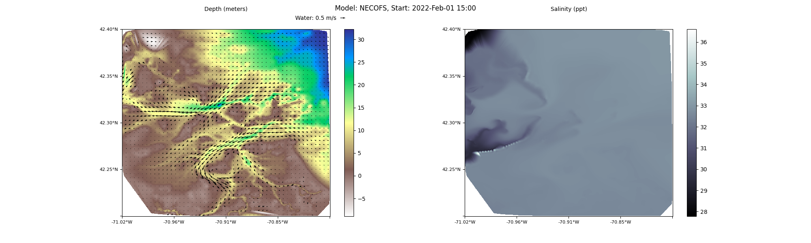

# Tutorial: ASV path planning using `whelk` and `conch`

## Introduction

The purpose of this tutorial is to demonstrate the use of software repositories [whelk](https://github.com/ekrell/whelk) and [conch](https://github.com/ekrell/conch) to generate an energy efficient path for an [autonomous surface vehicle (ASV)](https://www.sciencedirect.com/topics/earth-and-planetary-sciences/surface-vehicle). 

Consider the following planning mission. You are located on a vessel in Boston Harbor and are going to deploy an ASV that will navigate to a target location. The vehicle is equipped with an [onboard controller](https://www.hindawi.com/journals/mpe/2018/7371829/) capable of maintaining a heading and desired speed to reach a target location. To effectively navigate to the target, the controller requires a plan: a sequence of waypoints that form an obstacle-free path from vehicle’s current location to the goal. The following figure shows the ASV's **start** and **goal** locations. 

Clearly the vessel cannot travel in a straight line to reach the goal - Spectacle Island is in the way. 
The most obvious planning criteria is that the path should be **feasible**: the vehicle cannot navigate through obstacles. 
We also prefer the path to be, at least in some sense, **good**. That is, a path that is optimal or near-optimal for some criteria. 
A shortest-distance path is an obvious choice, but often not the best for vehicles operating in the marine environment. 
Wind, waves, and water currents can substantially impact a vessel's efficiency. 
Ideally, the vehicle would avoid going against forces that oppose it and instead take advantage of those that are headed toward the goal. 
Even if this means deviating from the shortest path, it may be much more energy efficient which is highly desirable considering the limited energy of ASVs. 

If we have a vector field of the spatio-temporal water currents over the extent of the mission, then we can plan a path that minimizes the energy expenditure of the ASV. The problem is that the data does not exist: we cannot completely predict the state of the complex marine environment. Instead, we rely on forecasts to act as our best guess as to how the currents will behave at least in the near future. For example, the [Northeast Coastal Ocean Forecast System (NECOFS)](http://fvcom.smast.umassd.edu/necofs/). In this tutorial, we will use the `whelk` repository to download NECOFS data for a specified region and time duration, then convert it to a raster (grid) format useful for path planning. 

If we have a map of Boston Harbor and the local water current forecasts, then we should be able to plan a route for energy-efficient and obstacle-free ASV navigation. In this tutorial, we will use planning software in the `conch` repository to do so. 

Now consider why the ASV is going to that goal location. In our fictitious scenario, suppose that the vehicle is going to use its onboard sensors to collect detailed data on an [eelgrass habitat at that location](http://oceans.mit.edu/news/featured-stories/mit-sea-grass-work-featured-york-times.html). Now suppose that the vehicle's energy efficient route has the vehicle navigating close to other patches of seagrass along the way. Without explicitly targeting those patches, we might get more useful data from the mission if the waypoints were slightly modified so that the ASV passes over and samples those patches. We call this **opportunistic reward-based planning.** Unlike [coverage planners](https://www.researchgate.net/publication/221071829_Towards_marine_bloom_trajectory_prediction_for_AUV_mission_planning) that seek to maximize the sampling reward within time/energy constraints, we are proposing to still perform a point-to-point planning but with slightly relaxed efficiency constraints to take advantage of nearby sampling opportunities. In this tutorial, we will demonstrate using a raster grid of reward values to achieve opportunistic reward-based planning. For simplicity, we will rely on a synthetic reward grid. But it is based on real-world applications. Consider using satellite imagery to get coarse visual dataon habitat locations, then following up with the ASV for detailed water measurements and underwater imagery. 

This tutorial will explain:

1. How to aquire the input data to represent the planning environment (map of obstacles, water current forecasts, & reward)
2. How to use **Visibility Graphs** and **Particle Swarm Optimization** to generate a solution path

## Step 1: Acquire data 

The environment is represented using raster (gridded) data. 
The values of the cells are used to determine the fitness of a path.
The rasters must align! For example, coordinate (100, 75) must refer
to the same geographic location in all of the input rasters. 
This is what enables the planner to determine the obstacles, forces, 
and reward at a given raster location. 

### Setup environment

    $ mkdir asv_planning
    $ cd asv_planning
    $ git clone git@github.com:ekrell/whelk.git
    $ git clone git@github.com:ekrell/conch.git

### Region map (occupancy grid)

A map of the environment is the only required data input. 
By itself, you can plan a **collision-free, shortest-distance** path. 

A raster of the Boston Harbor planning environment is included at in the `conch` repo ([`test/inputs/full.tiff`](test/inputs/full.tif)).
The file format is a [GeoTiff](https://www.loc.gov/preservation/digital/formats/fdd/fdd000279.shtml): 
it contains a georeferenced raster dataset and associated geographic metadata. 
For path planning with `conch`, the values of this raster need to be `0` and `1`. 
This is called an [occupancy grid](https://en.wikipedia.org/wiki/Occupancy_grid_mapping)
where `0` indicates a free cell (here, water) and `1` is an obstacle. 
Be careful that the free space includes only water deep enough for your vessel's draft!

How to create one? There are various ways. I manually created the Boston Harbor raster using [QGIS](https://www.qgis.org/en/site/).
I simply used the polygon tool to [outline the coast and islands](https://docs.qgis.org/2.14/en/docs/training_manual/create_vector_data/create_new_vector.html), then [converted to raster](https://docs.qgis.org/2.8/en/docs/user_manual/processing_algs/gdalogr/gdal_conversion/rasterize.html).

Another idea: [take advantage of the NIR-absorption properties of water to convert satellite imagery to occupancy grids](https://github.com/ekrell/nir2watermap). Just be careful with the depth...

### Water currents forecast

Now we will use `whelk` to generate a raster of water current forecasts. 
So that we can see the entire forecast in a 2D plot, we will use a single forecast time step.

Use the geospatial metadata from the region map to set the correct options
to generate compatable forecasts. Specifically, we need to know the world
coordinates (lat, lon) of the top-left and bottom-right corners as well as
the number of raster rows and columns. 

    $ gdalinfo conch/test/inputs/full.tif
    Driver: GTiff/GeoTIFF
    Files: conch/test/inputs/full.tif
    Size is 1259, 1134
    Coordinate System is:
    GEOGCS["WGS 84",
        DATUM["WGS_1984",
            SPHEROID["WGS 84",6378137,298.257223563,
                AUTHORITY["EPSG","7030"]],
            AUTHORITY["EPSG","6326"]],
        PRIMEM["Greenwich",0],
        UNIT["degree",0.0174532925199433],
        AUTHORITY["EPSG","4326"]]
    Origin = (-71.019278655999997,42.400803791999998)
    Pixel Size = (0.000133352949960,-0.000133422306878)
    Metadata:
      AREA_OR_POINT=Area
    Image Structure Metadata:
      INTERLEAVE=BAND
    Corner Coordinates:
    Upper Left  ( -71.0192787,  42.4008038) ( 71d 1' 9.40"W, 42d24' 2.89"N)
    Lower Left  ( -71.0192787,  42.2495029) ( 71d 1' 9.40"W, 42d14'58.21"N)
    Upper Right ( -70.8513873,  42.4008038) ( 70d51' 4.99"W, 42d24' 2.89"N)
    Lower Right ( -70.8513873,  42.2495029) ( 70d51' 4.99"W, 42d14'58.21"N)
    Center      ( -70.9353330,  42.3251533) ( 70d56' 7.20"W, 42d19'30.55"N)
    Band 1 Block=1259x1 Type=Float64, ColorInterp=Gray
      NoData Value=nan
 
Based on the above, we know that the top-left corner is `(-71.0192787,  42.4008038)`
and the botton-right is `(-70.8513873,  42.2495029)`. The dimensions of the raster
is `1134 rows` and `1259 columns`. 

We will use a script from the `whelk` repository to extract the required ocean model data. 
The forecast date-time is specified based on the url of the [`netcdf` product](http://www.smast.umassd.edu:8080/thredds/catalog.html).
The following can be used to always access the latest forecast: http://www.smast.umassd.edu:8080/thredds/dodsC/FVCOM/NECOFS/Forecasts/NECOFS_FVCOM_OCEAN_MASSBAY_FORECAST.nc 

Generate the forecast rasters: 

    $ python3 whelk/NECOFS/necofs2raster.py \
      --nc http://www.smast.umassd.edu:8080/thredds/dodsC/FVCOM/NECOFS/Forecasts/NECOFS_FVCOM_OCEAN_MASSBAY_FORECAST.nc \
      --bounds -71.0192787,-70.8513873,42.2495029,42.4008038 \
      --rows 1134 --cols 1259 \
      --times 1 \                   # Number of time steps. With NECOFS, temporal resolution is hourly
      --geotiff_prefix forecast \   # How each of the output raster filenames should begin
      --plot forecast.png           # Will plot the data for handy reference (make sure you got what you wanted)
      
List the files to see the outputs.

    $ ls
    conch  forecast_height.tiff  forecast.png  forecast_salinity.tiff  forecast_uwater.tiff  forecast_vwater.tiff  whelk
  
What are these? 

- `forecast_height.tiff`: terrain height. (With a binary threshold based on boat's draft, should get an occupancy grid... haven't tried it yet).
- `forecast_salinity.tiff`: salinity values. 
- `forecast_uwater.tiff`: u-component of water current vector field.
- `forecast_vwater.tiff`: v-component of water current vector field. 

View the plot: `forecast.png`

However, `conch` expects the water currents rasters to be in terms of magnitude and direction. 
I made a utility to handle the conversion. The utility is called `magdir2uv.py`, which sounds
like the opposite of what we want. But there is the `--reverse` option that makes it do the opposite. 

    $ python3 conch/tools/magdir2uv.py \
        -u forecast_uwater.tiff -v forecast_vwater.tiff \   # What you have
        -m forecast_mwater.tiff -d forecast_dwater.tiff \   # What you need
        --reverse
    $ ls
    conch  forecast_dwater.tiff  forecast_height.tiff  forecast_mwater.tiff  forecast.png  
    forecast_salinity.tiff  forecast_uwater.tiff  forecast_vwater.tiff  whelk
    
### Reward

A sample reward raster is included in the `conch` repo ([`test/inputs/reward.txt`](test/inputs/reward.txt)).
This is a simple ASCII txt file where each number represents the reward value.
Again, it is critical that the dimensions (rows, columns) match the region raster. 
The reward values are plotted on the map above. The white pixels are lower reward and darker purples are more. 
Where you see the ocean, there is no reward.

I made this file manually with a text editor. In real life, reward values could originate from [satellite imagery](https://www.researchgate.net/publication/221071829_Towards_marine_bloom_trajectory_prediction_for_AUV_mission_planning),
[ocean model outputs](https://www.researchgate.net/publication/331053847_Path_planning_of_multiple_autonomous_marine_vehicles_for_adaptive_sampling_using_Voronoi-based_ant_colony_optimization), [previous ASV missions](https://www.researchgate.net/publication/282423266_Data-driven_robotic_sampling_for_marine_ecosystem_monitoring), etc. 

## Step 2: Generate path

### Example 1: shortest-distance planning

Inputs: region map. 

    python3 conch/planners/metaplanner.py \
        -r conch/test/inputs/full.tif \        # Input region raster
        --sy 42.32343 --sx -70.99428 \         # Start coordinates
        --dy 42.33600 --dx -70.88737 \         # Goal coordinates
        --speed 0.5 \                          # Target boat speed
        --generations 500 \                    # Number of PSO generations
        --pool_size 100 \                      # PSO pool size
        --num_waypoints 5 \                    # Number of waypoints
        --map dist.png \                       # Output plot of path
        --path dist.txt                        # Output path waypoints

Output plot of path:

### Example 2: energy-efficient planning 

Inputs: region map, water currents.

Discuss visibility graphs... 

**NEED: image of path with currents**

### Example 3: opportunistic reward-based planning

Inputs: region map, water currents, reward.

**NEED: image of path with currents and reward**

## Conclusions

